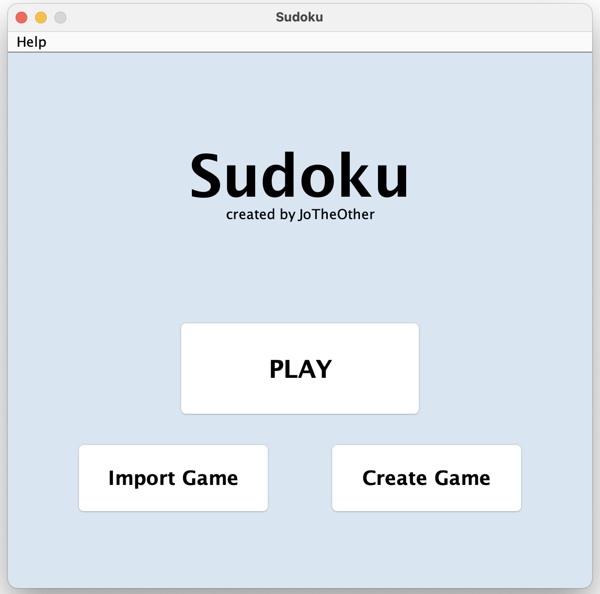
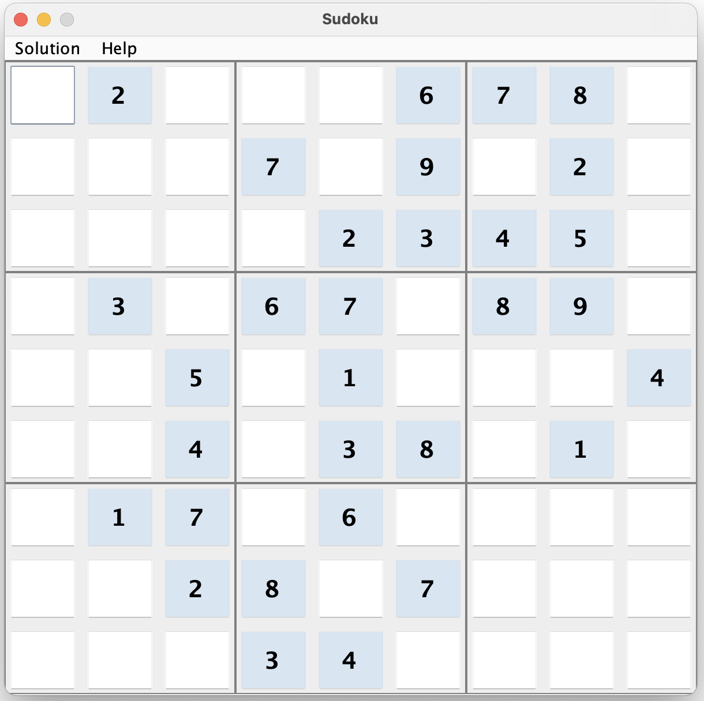

#  Sudoku Game Application in Java

This is a simple graphical user interface-based Sudoku game application. 
It offers three main functionalities - "Play", "Import", and "Create".

In the "Play" mode, the user can solve a randomly generated puzzle. The "Import" mode allows the user to import puzzles from text files. And in the "Create" mode, users can manually create and play their own Sudoku puzzles, provided they are valid and solvable.

All modes include a solver that uses backtracking and minimum remaining values (MRV) heuristic to automatically solve the puzzle.

To start playing Sudoku, simply compile and run the Sudoku.java file.

